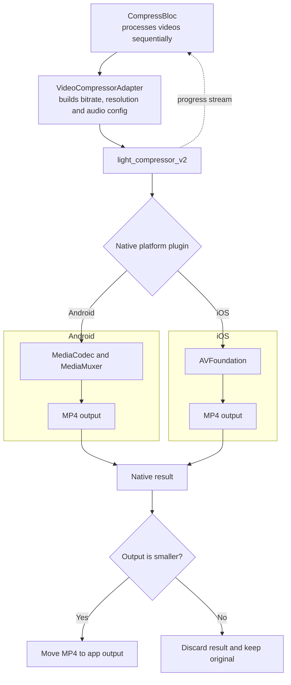

<!-- TODO: Add store links after release. -->
  

minimo (video) is a free mobile app for shrinking videos directly on your device.
No cloud upload. No subscription. Your videos stay yours.

## Features

- Simple quality presets: high, medium, low
- Advanced controls: resolution and audio
- Batch compression
- Progress screen with time estimate
- Save and share compressed videos
- Optional album saving
- English and Russian localization

## Roadmap

- [x] Simple quality presets
- [x] Batch compression
- [x] Resolution and audio controls
- [x] Compression progress, cancellation, saving, and sharing
- [ ] Custom bitrate
- [ ] Frame rate control
- [ ] H.264 and HEVC codec selection
- [ ] Compression speed presets
- [ ] Metadata preservation

## Native compression pipeline

Compression uses native platform APIs, not FFmpeg. Input, output, and intermediate files stay on the device.

### Why not FFmpeg?

Native Android codecs and AVFoundation keep the app smaller, use platform hardware acceleration, consume less battery, and avoid bundling another native runtime. They cover minimo's current goal: straightforward on-device video compression.

The trade-off is less low-level control and small output differences between Android and iOS. FFmpeg would make sense if the app needed identical cross-platform encoding, uncommon formats, or complex filter pipelines.

FFmpeg is available under LGPL or GPL depending on how it is built and which components are enabled. Shipping its binaries would require tracking that configuration and satisfying the corresponding redistribution, attribution, relinking, and source-code obligations. Using system Android and iOS codecs avoids distributing FFmpeg and keeps the app itself under the MIT License. Codec patent and store requirements may still apply independently.

## How to contribute

 

## Credits

Video compression is powered by [light_compressor_v2](https://pub.dev/packages/light_compressor_v2). Respect and thanks to its maintainers and contributors.

Special thanks to [Kamran Bekirov](https://x.com/kamranbekirovyz) and his website [Flutter Pro Design](https://flutterpro.design/). I learned from and adapted many ideas from his work for myself and for this app.

## Contacts

   

## License

